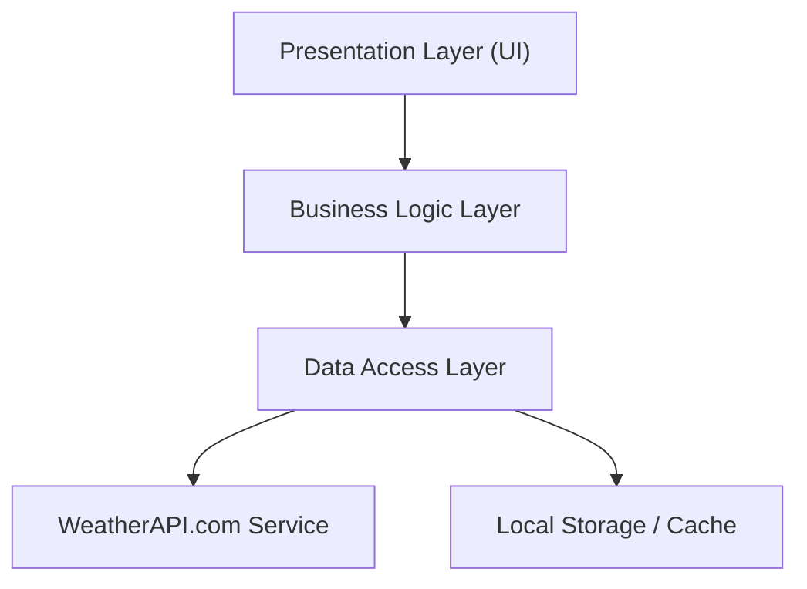
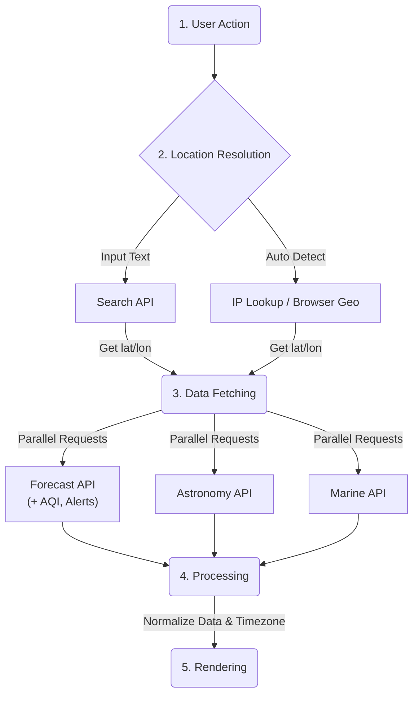

# Architecture Design: WeatherAPI Integration

Tài liệu này mô tả kiến trúc phần mềm đề xuất để tích hợp toàn bộ các tính năng được cung cấp bởi [WeatherAPI.com](https://www.weatherapi.com/docs/).

## 1. Tổng quan Hệ thống

Hệ thống được thiết kế theo mô hình **Modular Architecture** (Kiến trúc Mô-đun), chia nhỏ ứng dụng thành các thành phần độc lập dựa trên các nhóm tính năng của API. Điều này giúp dễ dàng bảo trì, mở rộng và quản lý code.

### Sơ đồ Kiến trúc Tầng (Layered Architecture)

## 2. Các Tầng Kiến trúc

### 2.1. Presentation Layer (Giao diện người dùng)
Chịu trách nhiệm hiển thị dữ liệu và tương tác với người dùng.
- **Components:**
  - **Dashboard**: Hiển thị tổng quan (Thời tiết hiện tại, Dự báo ngắn hạn).
  - **Search Bar**: Tích hợp Autocomplete cho địa điểm.
  - **Charts/Graphs**: Biểu đồ nhiệt độ, lượng mưa, AQI theo giờ/ngày.
  - **Maps**: Tích hợp Weather Maps (Tiles) cho nhiệt độ, mây, mưa.
  - **Widgets**: Các thẻ thông tin chuyên biệt (Thiên văn, Thể thao, Marine).
  - **Alert System**: Thông báo popup hoặc banner cho cảnh báo thời tiết.

### 2.2. Business Logic Layer (Xử lý nghiệp vụ)
Xử lý dữ liệu thô từ API thành định dạng phù hợp cho UI.
- **Unit Converter**: Chuyển đổi đơn vị (C/F, km/h / mph, mm/in) nếu cần xử lý phía client.
- **Date/Time Formatter**: Xử lý múi giờ (Time Zone API) và định dạng ngày tháng.
- **Data Aggregator**: Tổng hợp dữ liệu từ nhiều nguồn (ví dụ: kết hợp Weather + Astronomy).
- **Error Handler**: Xử lý các mã lỗi API (1006, 2007, 9999...) và hiển thị thông báo thân thiện.

### 2.3. Data Access Layer (Truy xuất dữ liệu)
Quản lý việc gọi API và lưu trữ dữ liệu.
- **API Client**: Wrapper cho `fetch` request, tự động đính kèm API Key và xử lý HTTP status.
- **Endpoints Manager**: Quản lý các URL endpoints (Current, Forecast, History, v.v.).
- **Caching Strategy**: Lưu cache các request giống nhau trong thời gian ngắn để tiết kiệm quota và tăng tốc độ (sử dụng `localStorage` hoặc `IndexedDB`).

## 3. Phân rã Mô-đun (Feature Modules)

Dựa trên tài liệu WeatherAPI, hệ thống được chia thành các mô-đun sau:

### 3.1. Core Weather Module
- **Realtime API**: Lấy dữ liệu thời tiết hiện tại (`/current.json`).
- **Forecast API**: Lấy dự báo 1-14 ngày, bao gồm chi tiết theo giờ (`/forecast.json`).
- **History API**: Tra cứu dữ liệu lịch sử từ 2010 (`/history.json`).
- **Future API**: Dự báo xa (14-300 ngày) (`/future.json`).

### 3.2. Location & Geo Module
- **Search/Autocomplete API**: Gợi ý địa điểm khi người dùng nhập liệu (`/search.json`).
- **IP Lookup API**: Tự động xác định vị trí qua IP (`/ip.json`).
- **Time Zone API**: Lấy thông tin múi giờ và giờ địa phương chính xác (`/timezone.json`).

### 3.3. Environmental Module
- **Air Quality Data**: Tích hợp trong Forecast/Current API (`aqi=yes`). Hiển thị chỉ số EPA, Defra, PM2.5, PM10, O3, NO2...
- **Pollen API**: (Gói Enterprise) Hiển thị chỉ số phấn hoa (`pollen=yes`).
- **UV Index**: Hiển thị và cảnh báo chỉ số tia cực tím.

### 3.4. Specialized Weather Module
- **Marine Weather API**: Dành cho người dùng biển/đại dương (`/marine.json`).
  - Dữ liệu thủy triều (Tides).
  - Sóng biển (Swell height, direction, period).
  - Nhiệt độ nước.
- **Astronomy API**: Thông tin mặt trời/mặt trăng (`/astronomy.json`).
  - Bình minh/Hoàng hôn.
  - Trăng mọc/Trăng lặn, Pha mặt trăng, Độ sáng.
- **Sports API**: Thời tiết cho các sự kiện thể thao (`/sports.json`).
  - Bóng đá, Cricket, Golf.

### 3.5. Alerts & Maps Module
- **Weather Alerts**: Cảnh báo thiên tai từ các cơ quan chính phủ (`alerts=yes`).
- **Weather Maps**: Hiển thị các lớp bản đồ (Tiles) cho Nhiệt độ, Mưa, Gió, Áp suất.

### 3.6. Bulk Operations Module
- **Bulk Request**: Xử lý nhiều địa điểm trong một request (dành cho gói Pro+ trở lên) để tối ưu hóa hiệu năng cho các dashboard theo dõi nhiều thành phố.

## 4. Luồng dữ liệu (Data Flow)

## 5. Bảo mật và Hiệu năng

- **API Key Protection**: Không lưu cứng API Key trong code client-side nếu deploy production (nên dùng Proxy Server). Trong môi trường demo tĩnh, sử dụng biến môi trường hoặc file config tách biệt.
- **Rate Limiting**: Theo dõi header phản hồi để tránh vượt quá quota.
- **Error Handling**: Xử lý graceful degradation (ví dụ: nếu lỗi API Thiên văn, vẫn hiển thị Thời tiết cơ bản).

---
*Tài liệu này dựa trên phiên bản API 1.0.2 của WeatherAPI.com.*
