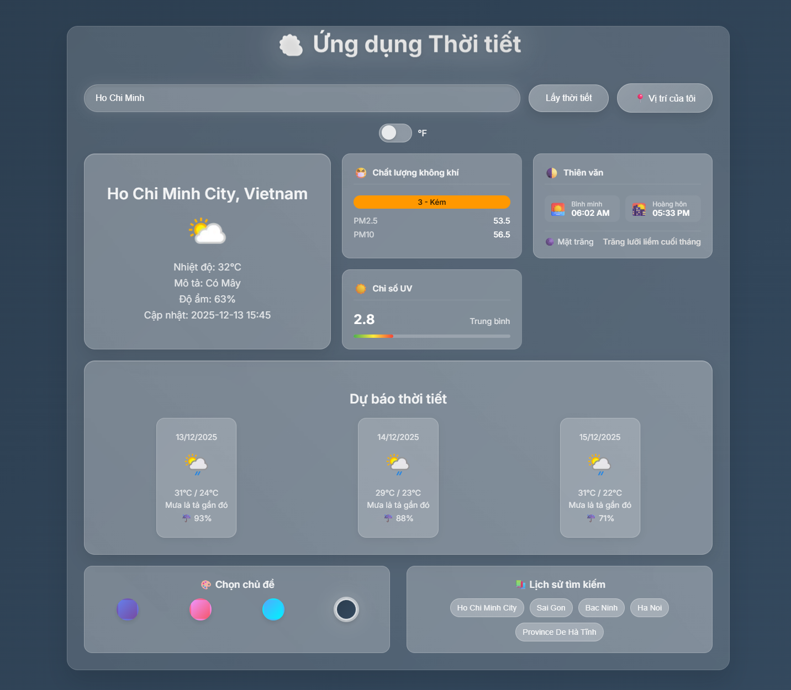

# 🌤️ Weather App

Ứng dụng dự báo thời tiết hiện đại, giao diện Glassmorphism đẹp mắt, tích hợp đầy đủ các chỉ số môi trường và thiên văn từ WeatherAPI.com.



## ✨ Tính năng nổi bật

*   **Dự báo thời tiết 3 ngày**: Hiển thị chi tiết nhiệt độ thấp nhất/cao nhất, tình trạng thời tiết và khả năng mưa.
*   **Chỉ số môi trường chuyên sâu**:
    *   **Chất lượng không khí (AQI)**: Hiển thị chỉ số EPA cùng đánh giá màu sắc trực quan (Tốt, Trung bình, Kém...), chi tiết bụi mịn PM2.5, PM10.
    *   **Chỉ số UV**: Thanh hiển thị mức độ tia cực tím và khuyến cáo bảo vệ.
*   **Thông tin Thiên văn**:
    *   Giờ bình minh / hoàng hôn.
    *   Pha mặt trăng (Moon Phase) được dịch sang tiếng Việt (Trăng non, Trăng tròn, v.v.).
*   **Cảnh báo thiên tai**: Hiển thị các cảnh báo thời tiết nguy hiểm từ cơ quan chức năng.
*   **Giao diện Glassmorphism**: Thiết kế kính mờ hiện đại, hiệu ứng động mượt mà.
*   **Tùy biến giao diện**:
    *   Chuyển đổi đơn vị độ C / độ F.
    *   4 chủ đề màu sắc: Xanh đại dương, Hồng đào, Xanh rừng, Tối mịn.
*   **Lịch sử tìm kiếm**: Lưu lại 5 địa điểm tìm kiếm gần nhất.
*   **Responsive**: Tối ưu hiển thị trên mọi thiết bị từ Desktop đến Mobile.

## 🛠️ Công nghệ sử dụng

*   **Frontend**: HTML5, CSS3 (Flexbox, Grid, Animations), JavaScript (ES6 Modules).
*   **API**: [WeatherAPI.com](https://www.weatherapi.com/) (Free Plan).
*   **Lưu trữ**: LocalStorage (Lưu lịch sử, cài đặt giao diện).

## 🚀 Cài đặt và Sử dụng

1.  **Clone dự án**:
    ```bash
    git clone https://github.com/your-username/WeatherAPI.git
    cd WeatherAPI
    ```

2.  **Cấu hình API Key**:
    *   Đăng ký tài khoản miễn phí tại [WeatherAPI.com](https://www.weatherapi.com/).
    *   Mở file `src/config.js` và dán API Key của bạn vào:
    ```javascript
    const CONFIG = {
        API_KEY: 'YOUR_API_KEY_HERE', // Thay thế bằng key của bạn
        BASE_URL: 'https://api.weatherapi.com/v1/forecast.json'
    };
    export default CONFIG;
    ```

3.  **Chạy ứng dụng**:
    *   Mở file `index.html` bằng trình duyệt web (hoặc sử dụng Live Server trong VS Code).

## 📂 Cấu trúc thư mục

```
WeatherAPI/
├── assets/             # Tài nguyên hình ảnh, icon
├── docs/               # Tài liệu dự án
│   ├── ARCHITECTURE.md # Sơ đồ kiến trúc hệ thống
│   └── README.md       # Hướng dẫn sử dụng
├── src/
│   ├── config.js       # Cấu hình API
│   ├── script.js       # Logic chính của ứng dụng
│   └── styles.css      # Stylesheet giao diện
└── index.html          # File HTML chính
```

## 🤝 Đóng góp

Mọi đóng góp đều được hoan nghênh! Vui lòng tạo Pull Request hoặc mở Issue để báo lỗi/đề xuất tính năng.

## 📄 Giấy phép

Dự án này được phân phối dưới giấy phép MIT. Xem file `docs/LICENSE` để biết thêm chi tiết.
