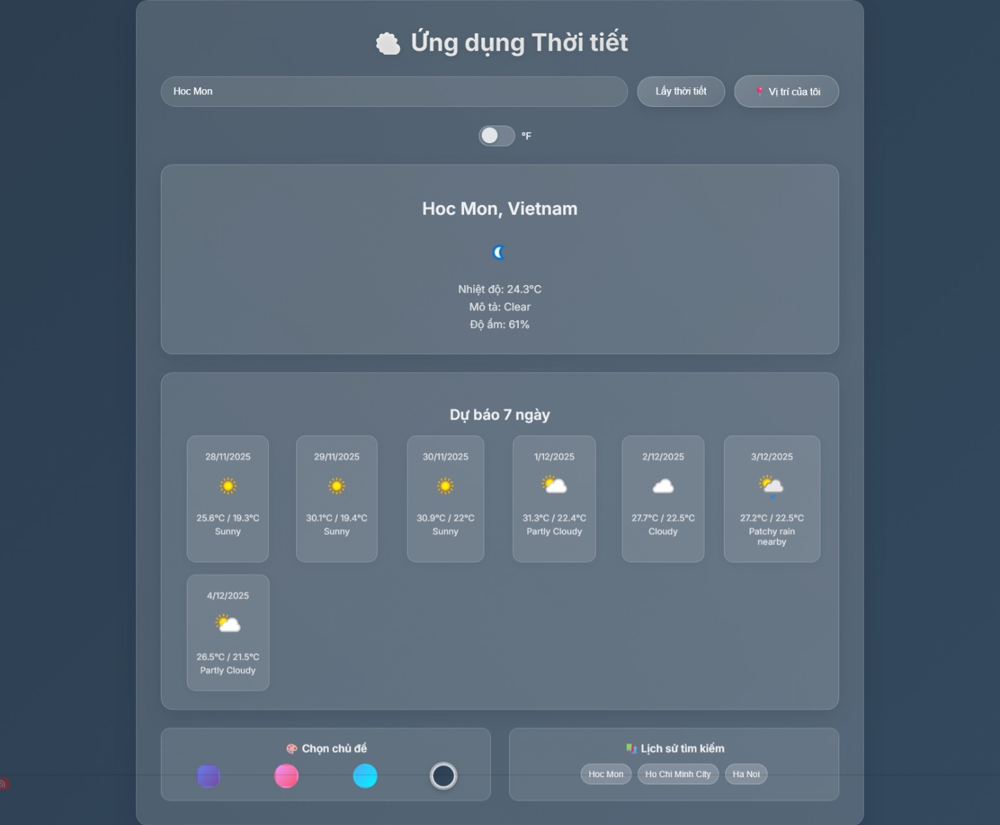

# 🌤️ Ứng dụng Thời tiết

Một ứng dụng web thời tiết hiện đại với giao diện glassmorphism, cung cấp thông tin thời tiết hiện tại và dự báo 7 ngày.

## ✨ Tính năng

- **Thời tiết hiện tại**: Hiển thị nhiệt độ, điều kiện thời tiết, độ ẩm, tốc độ gió, v.v.
- **Dự báo 7 ngày**: Xem dự báo thời tiết cho tuần tới.
- **Định vị tự động**: Lấy thời tiết tại vị trí hiện tại của bạn.
- **Chuyển đổi đơn vị**: Chuyển đổi giữa °C và °F.
- **Lịch sử tìm kiếm**: Lưu trữ và truy cập nhanh các thành phố đã tìm.
- **Chọn chủ đề**: 8 chủ đề màu sắc đẹp mắt với hiệu ứng glassmorphism.
- **Giao diện responsive**: Tương thích với desktop và mobile.
- **Nhấn Enter để tìm**: Tìm kiếm nhanh bằng phím Enter.

## 🚀 Demo

[](https://tienxdun.github.io/WeatherAPI/)

**Xem live demo:** [https://tienxdun.github.io/WeatherAPI/](https://tienxdun.github.io/WeatherAPI/)

## 🛠️ Cài đặt

1. **Clone repository:**
   ```bash
   git clone https://github.com/TienxDun/WeatherAPI.git
   cd WeatherAPI
   ```

2. **Lấy API Key miễn phí:**
   - Đăng ký tại [WeatherAPI.com](https://www.weatherapi.com/).
   - Sao chép API Key từ dashboard.

3. **Tạo file config.js:**
   - Tạo file `config.js` trong thư mục dự án.
   - Thêm nội dung sau và thay `'YOUR_API_KEY_HERE'` bằng API Key thực tế:
     ```javascript
     const CONFIG = {
         API_KEY: 'your_actual_api_key',
         BASE_URL: 'https://api.weatherapi.com/v1/forecast.json'
     };
     
     export default CONFIG;
     ```
   **Quan trọng:** File `config.js` đã được thêm vào `.gitignore` để không commit lên GitHub!

3. **Chạy server local:**
   - Sử dụng Python (nếu có):
     ```bash
     python -m http.server 8000
     ```
   - Hoặc mở trực tiếp `index.html` trong trình duyệt (nhưng có thể gặp lỗi CORS).

4. **Truy cập:** Mở `http://localhost:8000` trong trình duyệt.

## 📖 Cách sử dụng

1. Nhập tên thành phố vào ô tìm kiếm.
2. Nhấn Enter hoặc click "Lấy thời tiết".
3. Xem thông tin thời tiết hiện tại và dự báo.
4. Sử dụng "📍 Vị trí của tôi" để lấy thời tiết tại vị trí hiện tại.
5. Chuyển đổi đơn vị nhiệt độ bằng toggle °F.
6. Chọn chủ đề màu từ sidebar.
7. Xem lịch sử tìm kiếm để truy cập nhanh.

## 🔧 Công nghệ sử dụng

- **HTML5**: Cấu trúc trang web.
- **CSS3**: Styling với glassmorphism, gradients, animations.
- **JavaScript (ES6+)**: Logic ứng dụng, API calls, localStorage.
- **WeatherAPI**: API cung cấp dữ liệu thời tiết.

## 📝 API

Ứng dụng sử dụng [WeatherAPI](https://www.weatherapi.com/) với endpoint:
- `http://api.weatherapi.com/v1/forecast.json?key={API_KEY}&q={city}&days=7&aqi=no&alerts=no`

## 🤝 Đóng góp

Mời đóng góp! Fork repository, tạo branch mới, và gửi pull request.

## 📄 Giấy phép

Dự án này sử dụng giấy phép MIT. Xem file `LICENSE` để biết thêm chi tiết.

## 👨‍💻 Tác giả

[TienxDun](https://github.com/TienxDun)

---
